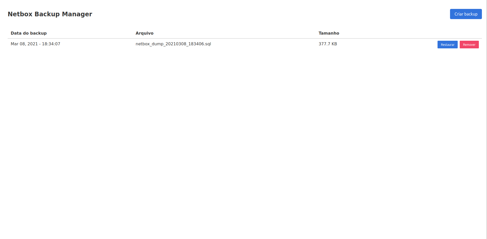

<h1 align="center">Netbox</h1>

<div align="center">
  Repositório criado para simplificar a instalação e configuração do <a href='https://netbox.readthedocs.io/en/stable/'>Netbox</a>.
</div>

<div align="center">
  <sub>Desenvolvido por
  <a href="mailto:andremuzel@gmail.com">André Müzel Brisolla</a>
</div>

</br>


- [Sobre o Netbox](#Sobre-o-Netbox)
- [Pré-requisitos](#Pré-requisitos)
- [Instalação](#Instalação)
- [Acesso a aplicação](#Acesso-a-aplicação)
- [Painel de Backup do Netbox](#Painel-de-Backup-do-Netbox)
- [Arquitetura do ambiente](#Arquitetura-do-Ambiente)

## Sobre o Netbox
O Netbox é uma aplicação web de código aberto criado para ajudar na gestão e na documentação de redes de computadores. Itens que o Netbox pode gerenciar:

- __Gestão de endereços de IP (IPAM):__ Endereços de IP, VRFs, e VLANs
- __Equipamentos (racks):__ Organizado por grupo e site
- __Dispositivos:__ Tipos de dispositivos e onde estão instalados
- __Conexões:__  Rede, console, conexões entre os dispositivos
- __Virtualização:__ Clusters e Maquinas Virtuais
- __Data circuits:__ Long-haul communications circuits and providers
- __Senhas:__  Armazenamento criptografado de credenciais

</br>

## Pré-requisitos
#### Acessos
Conexão com a internet para baixar os dados necessários para realizar a contrução das imagens dos containers.

#### Pacotes
Centos:
```bash 
yum install git -y
```
Ubuntu/Debian:
```bash 
apt install git -y
```
#### Docker 
*O script de instalação contempla a instalação e configuração do Docker
```bash
curl -s https://get.docker.com | sh
```
#### Docker Compose
*O script de instalação contempla a instalação e configuração do Docker Compose
```bash
curl -L "https://github.com/docker/compose/releases/download/1.28.5/docker-compose-$(uname -s)-$(uname -m)" -o /usr/local/bin/docker-compose
sudo chmod +x /usr/local/bin/docker-compose
```

#### Armazenamento
File System /var/lib/postgresql com 20GB

#### Estrutura de diretórios
```bash
mkdir /var/lib/postgresql{dumps,data}
```

</br>

## Instalação
Clonar o repositório de instalação do Netbox
```bash
cd /srv/
git clone https://github.com/andrebrisolla/netbox.git
cd netbox
```
Alterar a senha do Postgres e do Netbox no arquivo .env
```
POSTGRES_PASSWORD=password
NETBOX_PASSWORD=password
```

Instalação completa ( Contempla instalação do Docker e Docker Compose )
```bash
./install.sh --all
```
Realiza o build da imagem e inicia os containers ( Não contempla instalação do Docker e Docker Compose )
```bash
./install.sh --build
```

</br>

## Acesso a aplicação
O acesso a aplicação é realizado via porta 80, por exemplo: `http://192.168.0.1/`

</br>

## Painel de Backup do Netbox
O Painel de Backup do Netbox foi desenvolvido gerenciar o backup da base de dados do Netbox. Nele você pode realizar, remover e restaurar um backup. O endereço para acessar o painel é `http://[IP]/backup_webapp/`



</br>

## Arquitetura do ambiente


## License
[MIT](https://tldrlegal.com/license/mit-license)

